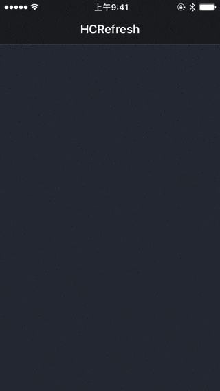

# HCRefresh
HCRefresh是一款简单易用的刷新框架

## 效果展示



## 代码集成
```
pod 'HCRefresh'
```


## 使用示例
### 添加刷新（selector方式）

```objc
    [scrollView hc_addHeaderRefreshWithTarget:self actionSelector:@selector(headerRefresh)];
    [scrollView hc_addFooterRefreshWithTarget:self actionSelector:@selector(footerRefresh)];
    
```

### 添加刷新（block方式）
```objc
    [scrollView hc_addHeaderRefreshWithActionBlock:^{
        
    }];
    
    [scrollView hc_addFooterRefreshWithActionBlock:^{
        
    }];
    
```

### 停止刷新
```objc
    //停止下拉刷新（不显示更新信息）
    [_scrollView hc_stopHeaderRefresh];
    
    //停止下拉刷新（显示更新信息）
    [_scrollView hc_stopHeaderRefreshAndShowMessage:@"更新了10条信息"];
        
    //停止上部刷新
    [_scrollView hc_stopFooterRefresh];
    
```
    

### 设置UI细节(如果需要配置，应写在添加刷新代码的前面)
```objc
    //顶部刷新文字的颜色（默认灰色）
    [HCRefreshManager shareManager].refreshTitleColor = HC_UICOLOR_RGB(100, 100, 100);
    
    //顶部显示的刷新文字内容
    [HCRefreshManager shareManager].refreshTitle = @"HCRefresh";
    
    //顶部刷新文字的字体（默认系统加粗字体24号）
    [HCRefreshManager shareManager].refreshTitleFont = [UIFont boldSystemFontOfSize:24];
    
    //顶部刷新文字在显示动画时的高亮颜色（默认白色）
    [HCRefreshManager shareManager].refreshTitleTinColor = HC_UICOLOR_RGB(255, 255, 255);
    
    //更多设置请参照代码注释
    //...
    
```

### 自定义刷新视图View
 上拉以及下拉刷新均可设置为自定义的View视图，步骤如下：
  
 1. 新建View类，并遵循HCRefreshCustomViewDelegate协议
 2. 使用initWithFrame初始化方法，并设置你所需要的UI
 3. 完成对应的代理方法
 
#### 示例：
 
 自定义CustomRefreshView类
 
 ```objc
 @interface CustomRefreshView()<HCRefreshCustomViewDelegate>

@end

@implementation CustomRefreshView
{
    UILabel *titleLabel;
}

-(instancetype)initWithFrame:(CGRect)frame
{
    self = [super initWithFrame:frame];
    if (self) {
        self.backgroundColor = [[UIColor purpleColor] colorWithAlphaComponent:0];
        
        UILabel *label = [[UILabel alloc] initWithFrame:self.bounds];
        label.font = [UIFont systemFontOfSize:15];
        label.textColor = [UIColor whiteColor];
        label.textAlignment = NSTextAlignmentCenter;
        [self addSubview:label];
        titleLabel = label;
    }
    return self;
}

#pragma mark -HCRefreshCustomViewDelegate代理
-(void)hcRefreshViewProgressChangedWithProgress:(float)progress
{
    self.backgroundColor = [[UIColor purpleColor] colorWithAlphaComponent:progress];
}

-(void)hcRefreshViewStateChangedWithNewState:(HCRefreshState)newState
{
    switch (newState) {
        case HCRefreshState_Normal: //常规状态
        {
           titleLabel.text = @"上拉加载更多";
        }
            break;
        case HCRefreshState_PrepareRefresh: //准备刷新状态
        {
           titleLabel.text = @"松开即可刷新";
        }
            break;  
        case HCRefreshState_StartRefresh:  //正在刷新状态
        {
            titleLabel.text = @"正在刷新";
        }
            break; 
        default:
            break;
    }
}
    
 ```
 
 添加自定义视图
 ```objc
   [scrollView hc_addFooterRefreshWithTarget:self actionSelector:@selector(footerRefresh) customFooterView:[CustomRefreshView class]]; 
 ```
 
 
    
 
 


